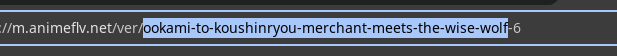

# AnimeFLV Downloader

Do you want free anime from AnimeFLV but the page is too slow and you just want the download links without waiting?

Don't worry! I'm here to save your life with `anime-fetch`, a CLI tool written in Python that will help you during this process.

## How to Install

### Ubuntu/Debian based

Install the .deb package in Releases with the tools offered within your distro, if they aren't included you can install gdebi

```sh
sudo apt install gdebi
```

## How to Run

Just execute

```sh
anime-fetch
```

And you are done!

## How to Use

At the start you will have three possible options:

1. Download every chapter
2. Download a selection
3. Download only one chapter(Use it for Movies)

Then three possible servers can be selected:

1. Mega
2. 1Fichier
3. Stape (Possibly I will remove this server because almost always chapters are missing)

Now you will have to enter the id of the serie, you can get it in the url of the serie at <https://m.animeflv.net/>



And enter the ID in the prompt.

Then you will enter the number of chapters, the start and end point or the chapter you want depending on the option you selected at startup.

That's it! The program will do the hardest part for you and give the links for the server you selected.

## Thanks to

[jorgeajimenezl](https://github.com/jorgeajimenezl/) for creating animeflv-api and making this program possible

## Fluff

You can contribute with MRs if you like this program to improve it and fix possible bugs, thanks for using!
